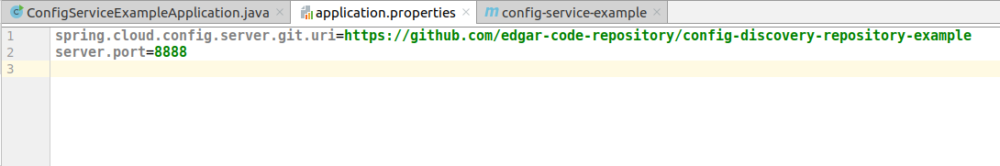
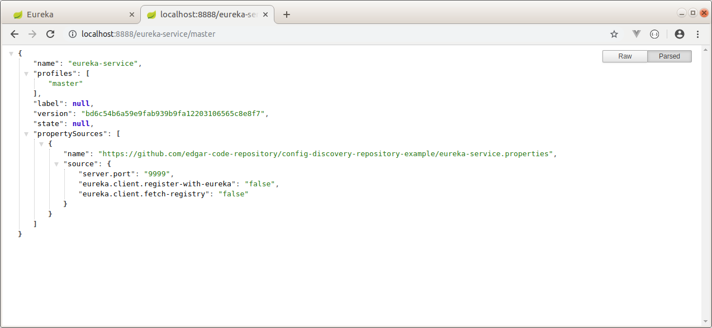
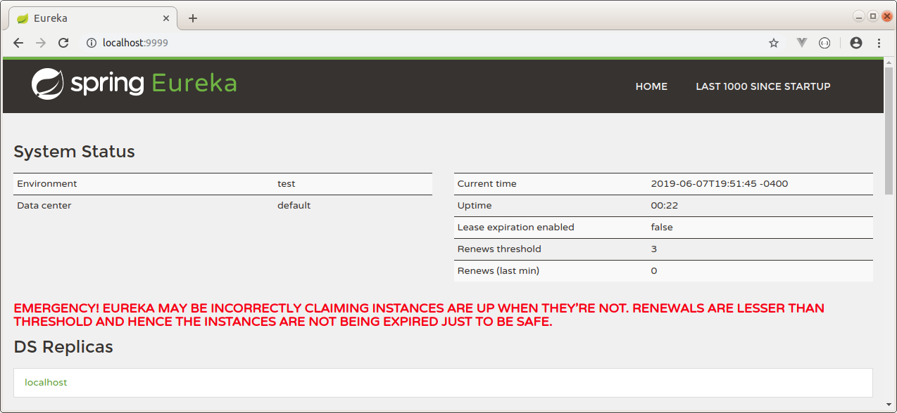
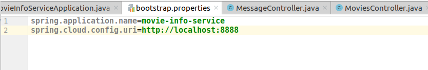
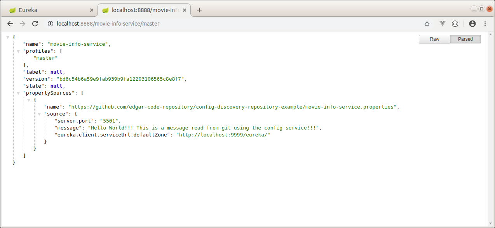
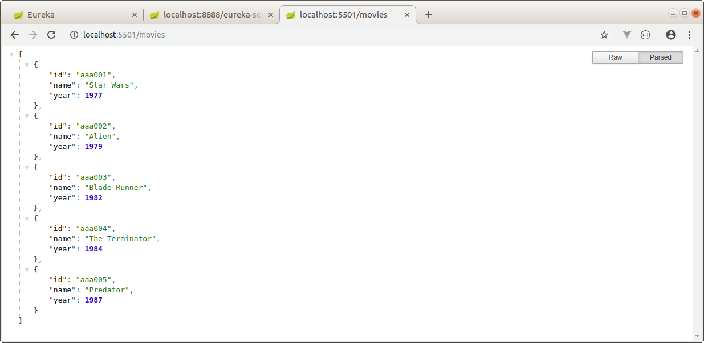
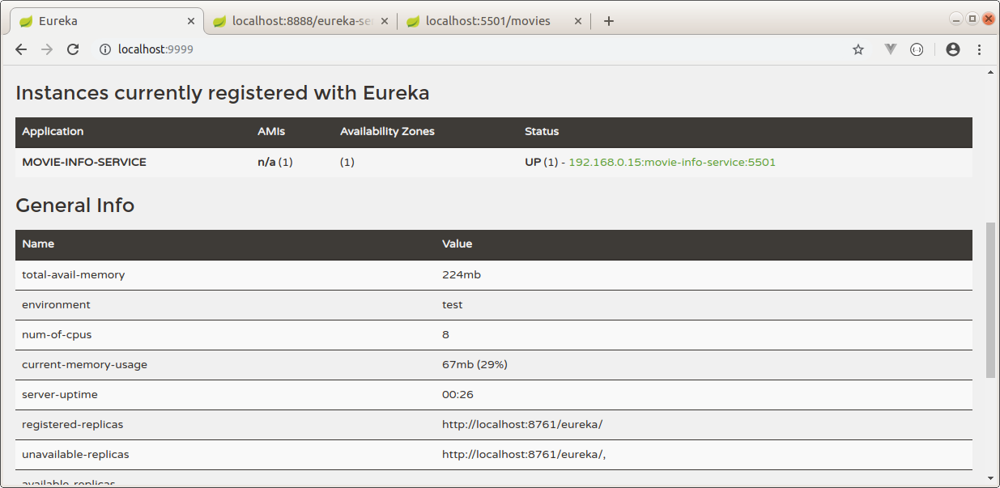

SPRING CLOUD EXAMPLE WITH CONFIG SERVICE AND DISCOVERY SERVICE
--------------------------------------------------------------------------------------------------------------------

Microservicios de ejemplo, desarrollados con Spring Boot y Spring Cloud que utilizan un config service 
y un discovery service.

Config Service: este servicio de configuracion levanta los datos de configuracion desde un repositorio GIT:

https://github.com/edgar-code-repository/config-discovery-repository-example

Eureka Service: este discovery service levanta su configuración desde el servicio de configuración.

Movie Info Service: este servicio contiene un Rest Controller que retorna información de peliculas.
Se conecta al servicio de configuracion, para obtener sus datos de configuración y se auto registra
con el servicio eureka. 

--------------------------------------------------------------------------------------------------------------------

El servicio de configuracion obtiene datos de configuracion desde repositorio git y se levanta en el puerto 8888:

--------------------------------------------------------------------------------------------------------------------

El servicio eureka recupera sus datos de configuración desde el servicio de configuracion.

Es importante notar que el nombre del archivo application.properties fue modificado a bootstrap.properties.

--------------------------------------------------------------------------------------------------------------------

El servicio de configuración informa a eureka que debe correr en el puerto 9999:

--------------------------------------------------------------------------------------------------------------------

El servicio eureka se levanta correctamente en el puerto 9999:

--------------------------------------------------------------------------------------------------------------------

El servicio movies-info-service recupera sus datos de configuración desde el servicio de configuracion.

Es importante notar que el nombre del archivo application.properties fue modificado a bootstrap.properties.

--------------------------------------------------------------------------------------------------------------------

El servicio de configuración informa al servicio movies-info-service que debe correr en el puerto 5501:

--------------------------------------------------------------------------------------------------------------------

El servicio movies-info-service se levanta correctamente en el puerto 5501:

--------------------------------------------------------------------------------------------------------------------

El servicio movies-info-service se auto registra en el servidor eureka:

--------------------------------------------------------------------------------------------------------------------

Github repository:  https://github.com/edgar-code-repository/spring-cloud-config-discovery-example

