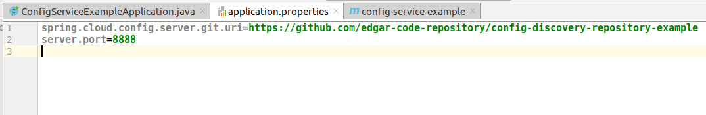
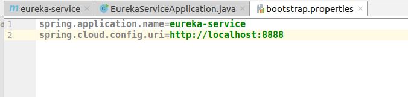

SPRING CLOUD EXAMPLE WITH CONFIG SERVICE AND DISCOVERY SERVICE
--------------------------------------------------------------------------------------------------------------------

Microservicios de ejemplo, desarrollados con Spring Boot y Spring Cloud, que levantan un config service, 
un discovery service y un servicio cliente que hace uso de los otros dos servicios.

**Config Service:** este servicio levanta datos desde un repositorio GIT.

  https://github.com/edgar-code-repository/config-discovery-repository-example

**Eureka Service:** este discovery service levanta su configuración desde el Config Service.

**Movie Info Service:** este servicio contiene un Rest Controller que retorna información de películas.
Se conecta al servicio de configuración para obtener sus datos y se registra automáticamente con el servicio eureka. 

--------------------------------------------------------------------------------------------------------------------

**Servicio de configuración**

**Dependencias**

```

  <dependency>
    <groupId>org.springframework.cloud</groupId>
    <artifactId>spring-cloud-config-server</artifactId>
  </dependency>

```

**Archivo de propiedades**

En el archivo application.properties se indica que este servicio se levanta en el puerto 8888 y obtiene datos 
desde un repositorio git:




**Anotaciones**

La anotación @EnableConfigServer permite que el servicio actue como un servicio de configuración:

```

@SpringBootApplication
@EnableConfigServer
public class ConfigServiceExampleApplication {

	public static void main(String[] args) {
		SpringApplication.run(ConfigServiceExampleApplication.class, args);
	}

}

```

**Ejecución**

El servicio de configuración obtiene datos de configuracion desde repositorio git y 
se levanta en el puerto 8888:


--------------------------------------------------------------------------------------------------------------------

**Servicio Eureka**

**Dependencias**

El servicio eureka recupera sus datos desde el servicio de configuración, para lo cual,
utiliza la dependencia "spring-cloud-starter-config".

Para correr como un servicio de discovery se requiere la dependencia "spring-cloud-starter-netflix-eureka-server".

```

  <dependency>
    <groupId>org.springframework.cloud</groupId>
    <artifactId>spring-cloud-starter-netflix-eureka-server</artifactId>
  </dependency>

  <dependency>
    <groupId>org.springframework.cloud</groupId>
    <artifactId>spring-cloud-starter-config</artifactId>
  </dependency>

```

**Archivo de propiedades**

Es importante notar que el nombre del archivo application.properties fue modificado a bootstrap.properties.
En el archivo bootstrap.properties se define el nombre del servicio y la url del servicio de configuración.



El servicio de configuración informa a eureka que debe correr en el puerto 9999:


**Anotaciones**

La anotación @EnableEurekaServer permite que el servicio actue como un servicio de discovery:

```

@SpringBootApplication
@EnableEurekaServer
public class EurekaServiceApplication {

	public static void main(String[] args) {
		SpringApplication.run(EurekaServiceApplication.class, args);
	}

}

```

**Ejecución**

El servicio eureka se levanta correctamente en el puerto 9999:


--------------------------------------------------------------------------------------------------------------------

**Servicio Movie Info**

**Dependencias**

Este servicio recupera sus datos desde el servicio de configuración, para lo cual,
utiliza la dependencia "spring-cloud-starter-config".

Para actuar como cliente del servicio de discovery se requiere la dependencia "spring-cloud-starter-netflix-eureka-client".

```
  <dependency>
    <groupId>org.springframework.cloud</groupId>
    <artifactId>spring-cloud-starter-config</artifactId>
  </dependency>

  <dependency>
    <groupId>org.springframework.cloud</groupId>
    <artifactId>spring-cloud-starter-netflix-eureka-client</artifactId>
  </dependency>

```

**Archivo de propiedades**

El servicio recupera sus datos desde el servicio de configuración.

Es importante notar que el nombre del archivo application.properties fue modificado a bootstrap.properties.


El servicio de configuración informa al servicio movie-info-service que debe correr en el puerto 5501:


**Anotaciones**

La anotación @EnableEurekaClient permite que el servicio actue como un cliente del servicio de discovery:

```

@SpringBootApplication
@EnableEurekaClient
public class MovieInfoServiceApplication {

	public static void main(String[] args) {
		SpringApplication.run(MovieInfoServiceApplication.class, args);
	}

}

```

**Ejecución**

El servicio se levanta correctamente en el puerto 5501:


El servicio se registra automaticamente con el servidor eureka:


--------------------------------------------------------------------------------------------------------------------


